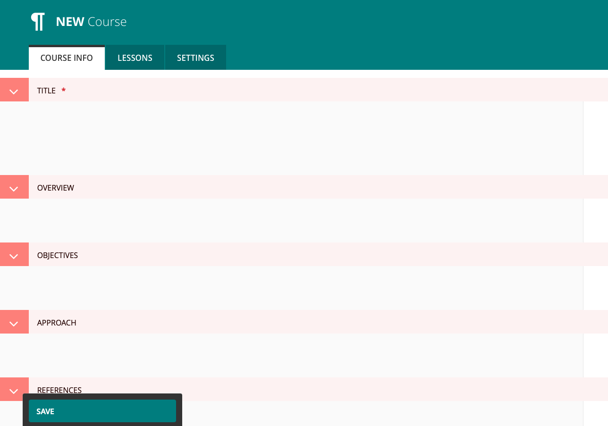

Handbook App Course Content
===================================

All courses available in the Handbook mobile app are created in this section. It is all very straightforward. 

To add new courses, go to the sidebar on the dashboard, right below the search element, is the Courses tab. 
Clicking this takes you to the dedicated courses section. 

In the top area, you can search through the existing courses. Or click the "Add course" button to create a new course.

Adding a new course
----------------------------

The course creation area has three(3) tabs i.e Course Info, Lessons and Settings. 

Course Info tab:
    In this section, we will add all the course meta data such as:

    * Title of the course, 
    * A brief overview, 
    * Objectives of the course
    * Approach for the course
    * Any references
    * A Featured image. 

    This all very straightforward. When all the necessary information has been filled, click Save.

Lessons tab:
    Every course has lessons. A course can have as many lessons as necessary. 
    These are added in this section. Under Course content, click the **"Add Lesson"** button.

    .. image:: _static/add-lesson.png
    
    Every lesson has a title and content. 

    Content can be multiple slides, a video or text as shown in the screenshot above.

    When content has been added for one lesson, you can save or click the **"Add Lesson"** button at the bottom to add another lesson.

Settings tab:
    Here we manage the availability of the course. We have the following options:

    * **Is Active:** This controls whether the course can be seen on the app or not. Old courses can simply be deactivated here.
    * **Featured:** Some courses need to be given prominence over others. This handles whether the course is highlighted in the app.
    * **Slug:** This is automatically generated from the title but can be edited and controls the link to the course in the app. Not neccessary to edit this.