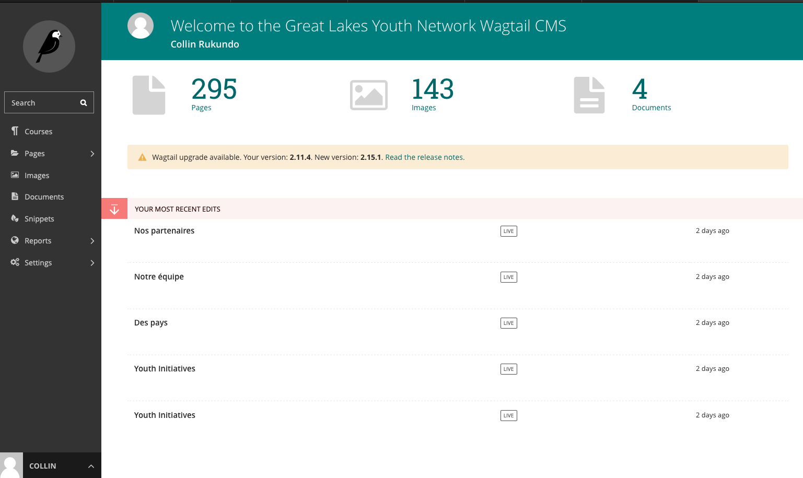
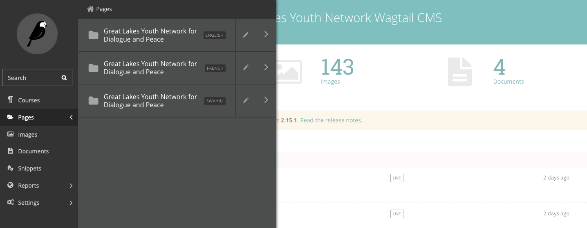
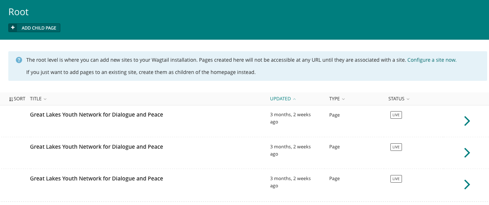

Navigating the CMS
===================================

Once you have logged in successfully, you will be redirected to the CMS Dashboard. 

    Wagtail dashboard. On the left is the Main Menu which is used to nagivate to and edit various parts of the CMS. At the top of the Dashboard shows the numbers of different types of content. Below these counts will be a list of Pages awaiting review. Below this list will be a second list of Pages which you most recently edited, if any.

You can return to the Dashboard at any time by clicking the Wagtail (bird) logo in the top left corner.

- The Dashboard shows the number of Pages, images, documents and associated languages currently stored on Wagtail.
- If you are authorized to moderate/review Pages, there will be a list of Pages awaiting your approval. Hovering over the title of the Page will give you several options:

    - Request changes - reject the changes and a comment explaining why
    - Approve - approve the changes and publish the Page
    - Approve with comment - approve the changes and publish the Page, adding a comment
    - Edit - edit the Page yourself
    - Preview - preview the changes on the frontend of the site
  
- If you have recently edited Pages, there will also be a list of your 5 most-recently edited Pages
- Clicking on the title of any Page in the Dashboard will take you to its Edit interface
- Each of the Page lists on the Dashboard also have a status:
  
   - Pages awaiting review will show the review status
   - Pages you have recently edited will show whether it is Live, Draft, or Live + Draft (indicating the Page is published but newer revisions are in a Draft state)

The Pages Menu
-------------------

The Pages Menu enables quick navigation through the levels of the site. Navigation using this menu enables you to move past a navigational level by clicking on the right arrow - or to open a navigational level by clicking its name. You can also navigate back by clicking the name of the containing folder above the list.

The top level of the Pages menu will be the different languages your country’s site is available in. For example, the site shown below is available in English, French and in Swahili.

    Notice the tags on the separate page trees for each language

**Here's what you need to know:**

- Click the Pages button in the sidebar to accesss the Menu.
- Clicking the name of a page will take you to the child pages within that page or to the page edit screen depending on where the page is in the hierachy.
- Clicking the right arrow displays the pages and enables you to navigate through the content structure.
- The more right arrows you click, the further down the content structure you move.

The Pages View
--------------------------

As noted above, the root Pages view contains the different language versions your country site is available in. Any child pages created here will not be accessible from any URL; you must create child pages within an existing site not the root.

    This is the Pages root section. DO NOT CREATE ANY PAGES here.

From the Pages root view, you can navigate to the Homepage of any language site. For the english site, the homepage may have the title: **Welcome**
